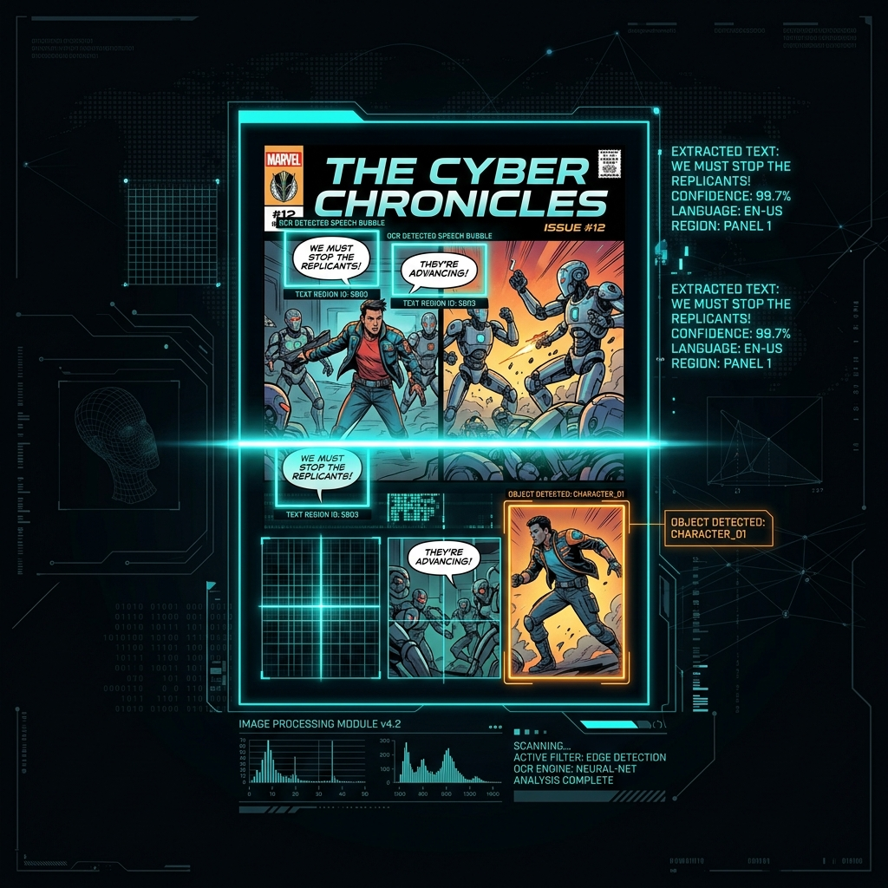
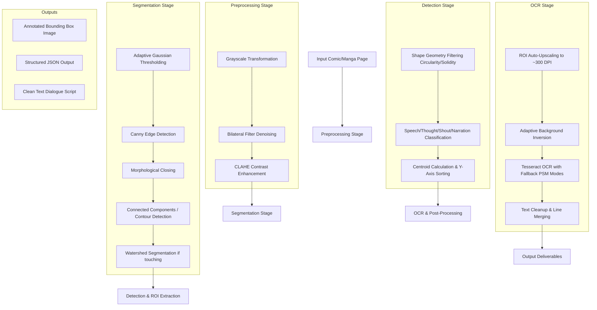

# 🧠 Speech Bubble-Aware OCR Studio



**A Digital Image Processing (DIP) based computer vision system and interactive suite designed to locate, classify, and extract text from comic, manga, and manhwa panels — bubble by bubble.**

---

## 📖 Table of Contents
1. [📌 Problem Statement](#-problem-statement)
2. [🏗️ System Architecture & Workflow](#️-system-architecture--workflow)
3. [🔬 DIP Mathematical Formulation](#-dip-mathematical-formulation)
4. [📂 Codebase Directory Structure](#-codebase-directory-structure)
5. [⚙️ Installation & Prerequisites](#️-installation--prerequisites)
6. [🧩 Full Stack & Development Setup](#-full-stack--development-setup)
7. [🚀 CLI Reference & Usage](#-cli-reference--usage)
8. [📦 Output Deliverables](#-output-deliverables)
9. [🐞 Debugging & Parameter Tuning](#-debugging--parameter-tuning)
10. [🔮 Future Vision: AI Manhwa Explainer](#-future-vision-ai-manhwa-explainer)
11. [🛠️ Tech Stack & Authors](#️-tech-stack--authors)

---

## 📌 Problem Statement

Traditional Optical Character Recognition (OCR) systems (such as standard Google Vision or Tesseract) are designed under the assumption of structured, line-by-line documents on clean white backgrounds. When applied directly to visual narrative mediums like comic panels, they fail spectacularly due to:
* **Background Textural Noise**: Screentones, speed lines, explosions, and character hair overlap text areas, resulting in OCR gibberish.
* **Layout Entanglement**: Standard systems read strictly left-to-right or top-to-bottom across the whole page, interweaving dialog from completely different speakers and breaking the semantic reading order.
* **Complex Bounding Geometries**: Dialogue is enclosed in speech bubbles that vary by shape, thickness, and color (e.g. spiky shout bursts, smooth ovals, cloud-like thoughts).
* **Stylized Artistic Fonts**: Decorative comic typography confuses character segmented classifiers.

### The Solution: Bubble-Aware Segmentation
This project implements a **divide-and-conquer** computer vision pipeline. Instead of running OCR on the entire image, the system isolates individual speech bubble geometries using classical Digital Image Processing (DIP) techniques, segments them into individual Regions of Interest (ROIs), cleanses background noise, scales them dynamically, and extracts text sequentially in their true reading order.

---

## 🏗️ System Architecture & Workflow

The entire pipeline is split into four distinct conceptual phases, operating entirely without heavy neural network models to guarantee interpretability, explainability, and speed:



---

## 🔬 DIP Mathematical Formulation

To build an explainable system, we utilize fundamental digital image processing equations. Here is the mathematical blueprint of our pipelines:

### 1. Grayscale Weighted Luminance
To discard color details while respecting human visual sensitivity to green and red light, we apply the weighted luminance formula:
$$Y = 0.299R + 0.587G + 0.114B$$

### 2. Edge-Preserving Denoising (Bilateral Filtering)
Standard Gaussian blur blends high-frequency text outlines and bubble boundaries, degrading downstream segmentation. We use a Bilateral Filter, which applies both spatial and radiometric Gaussian distributions:
$$I^{\text{filtered}}(i, j) = \frac{\sum_{k, l} I(k, l) \cdot w_s(i, j, k, l) \cdot w_r(I(i, j), I(k, l))}{\sum_{k, l} w_s(i, j, k, l) \cdot w_r(I(i, j), I(k, l))}$$
Where the spatial proximity weight $w_s$ is:
$$w_s(i, j, k, l) = \exp\left(-\frac{(i-k)^2 + (j-l)^2}{2\sigma_s^2}\right)$$
And the pixel intensity similarity weight $w_r$ is:
$$w_r(I(i, j), I(k, l)) = \exp\left(-\frac{\|I(i, j) - I(k, l)\|^2}{2\sigma_r^2}\right)$$
Because of $w_r$, the filter halts smoothing at high-contrast outlines (like dark bubble borders against light backgrounds), leaving boundaries pin-sharp while wiping away flat textures.

### 3. Canny Edge Gradients
To locate boundaries, Sobel kernels $G_x$ and $G_y$ find spatial derivative approximations:
$$G_x = \begin{bmatrix} -1 & 0 & +1 \\ -2 & 0 & +2 \\ -1 & 0 & +1 \end{bmatrix} * I, \quad G_y = \begin{bmatrix} +1 & +2 & +1 \\ 0 & 0 & 0 \\ -1 & -2 & -1 \end{bmatrix} * I$$
The composite gradient magnitude $G$ and directional angle $\theta$ are:
$$G = \sqrt{G_x^2 + G_y^2}, \quad \theta = \tan^{-1}\left(\frac{G_y}{G_x}\right)$$
Non-maximum suppression and hysteresis thresholding thin these gradients down to $1\text{-pixel}$ continuous outlines.

### 4. Morphological Boundary Healing
Comics drawn with sketching tools often contain minor gaps in speech outlines, leading to region "leaks" during contour expansion. We apply morphological **Closing** (dilation followed by erosion) using an elliptical kernel $K$:
$$\text{Closing}(A, K) = (A \oplus K) \ominus K$$
* **Dilation ($\oplus$)** expands boundaries to heal gaps up to size $K$.
* **Erosion ($\ominus$)** shrinks the healed lines back to their original width to preserve spatial dimensions.

### 5. Shape Geometry & Multi-Criteria Classification
We classify segmented contours into structural bubble types using descriptive geometric measures:
* **Circularity**: Determines roundness (where $1.0$ is a perfect circle):
$$\mathcal{C} = \frac{4\pi \cdot \text{Area}}{(\text{Perimeter})^2}$$
* **Solidity**: Compares the contour area to its convex envelope (Convex Hull):
$$\mathcal{S} = \frac{\text{Area}}{\text{Convex Hull Area}}$$
* **Extent**: Computes bounding box fill percentage:
$$\mathcal{E} = \frac{\text{Area}}{\text{Bounding Box Area}}$$

Using these metrics, bubbles are classified:
* **Speech Bubble**: $\mathcal{C} \approx 1.0, \mathcal{S} \approx 1.0$ (smooth elliptical contours).
* **Shout Bubble**: Low $\mathcal{S}$ (jagged outlines creating wide spaces within its convex hull).
* **Narration Box**: High rectangularity ($\mathcal{E} \approx 1.0$) with few vertices.
* **Thought Bubble**: Moderate circularity with high frequency perimeter oscillations.

### 6. Reading Order Sorting (Image Moments)
To sort dialogues logically from top-to-bottom, we compute bubble centroids ($c_x$, $c_y$) using spatial raw moments $M_{pq}$ over the binary image mask:
$$M_{pq} = \sum_{x} \sum_{y} x^p y^q I(x, y)$$
$$c_x = \frac{M_{10}}{M_{00}}, \quad c_y = \frac{M_{01}}{M_{00}}$$

---

## 📂 Codebase Directory Structure

```
comic-bubble-ocr/
├── main.py                   # Main pipeline orchestrator, CLI, and visual output writer
├── api.py                    # FastAPI server exposed endpoints (JSON + visual pipeline)
├── preprocessing.py          # Grayscale, Bilateral, CLAHE, and Thresholding algorithms
├── segmentation.py           # Watershed maps, Distance Transforms, and Contour engines
├── detection.py              # Geometric shape classifiers (Solidity, Circularity, Extent)
├── ocr.py                    # Tesseract integration, adaptive ROI upscaling, and PSM fallbacks
├── utils.py                  # Custom canvas overlays, SVG renderer, and file I/O operations
├── evaluate.py               # Quantitative evaluation utility (Character & Word accuracy)
├── app_launcher.py           # Standard multi-threaded server bootstrapper for PyInstaller
├── app_launcher.spec         # PyInstaller build spec for compiling to single-file .exe
├── requirements.txt          # Python virtual environment dependencies list
├── .gitignore                # Optimized ignore parameters (including LaTeX build files)
├── frontend/                 # Interactive Studio UI
│   ├── src/                  # React source (components, hooks, SVG canvas overlays)
│   ├── public/               # Static assets
│   ├── package.json          # Node dependencies (React 18, Vite, Lucide icons)
│   └── vite.config.js        # Vite configurations
├── samples/                  # Quality assurance testing samples
└── outputs/                  # Bounding box renders, JSON matrices, and text files
```

---

## ⚙️ Installation & Prerequisites

The system runs on **Python 3.8+** and requires the **Tesseract OCR** engine installed on the local system.

### 1. Install Tesseract OCR

#### 💻 Windows:
1. Download the windows binary installer from [UB-Mannheim Tesseract](https://github.com/UB-Mannheim/tesseract/wiki).
2. Run the installer and remember the installation directory (usually `C:\Program Files\Tesseract-OCR`).
3. Add the path `C:\Program Files\Tesseract-OCR` to your system Environment Variables under **PATH**.
4. *(Optional)* Download additional language training packs (e.g. `jpn` for Japanese, `kor` for Korean) from [tessdata](https://github.com/tesseract-ocr/tessdata) and copy them into `C:\Program Files\Tesseract-OCR\tessdata`.

#### 🐧 Linux (Ubuntu/Debian):
```bash
sudo apt update
sudo apt install tesseract-ocr tesseract-ocr-jpn tesseract-ocr-kor -y
```

#### 🍎 macOS:
```bash
brew install tesseract
```

### 2. Setup Python Environment
Create a clean virtual environment and install dependencies:
```bash
# Create virtual environment
python -m venv .venv

# Activate it (Windows PowerShell)
.\.venv\Scripts\Activate.ps1

# Activate it (Linux/macOS)
source .venv/bin/activate

# Install required libraries
pip install -r requirements.txt
```

---

## 🧩 Full Stack & Development Setup

For a modern visual experience, the application comes with a gorgeous React frontend showing side-by-side comparative pipelines.

### Standard Execution (Direct API + Dev UI)

1. **Boot the Backend FastAPI Server**:
   ```bash
   uvicorn api:app --host 127.0.0.1 --port 8000 --reload
   ```
2. **Boot the Vite Frontend Development Server**:
   ```bash
   cd frontend
   npm install
   npm run dev
   ```
3. Open `http://localhost:5173` in your browser. Upload any comic page to visualize active bounding boxes, click bubbles to review extracted text, and inspect intermediate binarized/grayscale results!

### Standalone Executable Run (Production Mode)

If compiled or provided as a standalone executable bundle:
1. Navigate to the `dist/` directory.
2. Double-click `app_launcher.exe`.
3. The background server starts automatically, launches your default web browser, and redirects you directly to the studio interface.
4. **Graceful Termination**: Clicking the **Close App** button in the top-right header will send a termination signal to the server, shutting down the background processes.

### Compiling to a Single Executable
To package the app for offline delivery:
```bash
# 1. Build frontend distribution
cd frontend
npm run build
cd ..

# 2. Compile python package via spec configuration
.\.venv\Scripts\pyinstaller --clean app_launcher.spec
```
The resulting executable will be generated at `dist/app_launcher.exe`.

---

## 🚀 CLI Reference & Usage

For large datasets, automated pipelines, or headless server runs, use `main.py` directly:

```bash
# Process a single comic panel with visual debug output saved to outputs/
python main.py --input samples/panel_01.png --debug

# Set language mode (Japanese Manga) and utilize vertical character orientation
python main.py --input samples/manga_page.jpg --lang jpn --min_area 800

# Enable watershed splitting for highly complex panel boundaries
python main.py --input samples/manhwa_04.png --watershed

# Run batch processing on a whole folder of pages
python main.py --input_dir samples/ --output_dir dataset_outputs/
```

### Complete CLI Argument Parameters:
| Argument | Type | Default | Description |
|----------|------|---------|-------------|
| `--input` | `str` | `None` | Path to single input image file |
| `--input_dir` | `str` | `None` | Path to directory containing multiple images |
| `--output_dir` | `str` | `outputs` | Target directory for generated files |
| `--min_area` | `int` | `500` | Minimum bounding pixel area to qualify as a speech bubble |
| `--lang` | `str` | `eng` | Language pack for Tesseract (e.g. `eng`, `jpn`, `kor`, `chi_sim`) |
| `--watershed` | `bool`| `False` | Apply distance transform watershedding on overlapping contours |
| `--debug` | `bool`| `False` | Write out all intermediate filtered images (grayscale, edge, mask) |

---

## 📦 Output Deliverables

Upon processing an image (e.g., `page_01.png`), the system populates a structured folder inside the `--output_dir`:

```
outputs/page_01/
├── annotated_page_01.png      # Bounding boxes highlighted and color-coded by bubble type
├── extracted_text.txt         # Clean textual format, grouped by Bubble IDs
├── ocr_results.json           # Programmatic coordinate matrix and text structures
└── debug/                     # (Optional) Intermediate filtering representations
    ├── 1_grayscale.png
    ├── 2_bilateral.png
    ├── 3_clahe.png
    ├── 4_binary.png
    └── 5_edges.png
```

### Bounding Coordinates Matrix Sample (`ocr_results.json`)
```json
[
  {
    "bubble_id": 1,
    "bubble_type": "speech",
    "centroid": [120, 245],
    "bbox": [80, 210, 160, 70],
    "text": "WHAT ARE YOU TALKING ABOUT?!",
    "confidence": 94.2
  },
  {
    "bubble_id": 2,
    "bubble_type": "thought",
    "centroid": [140, 560],
    "bbox": [100, 510, 180, 85],
    "text": "He seems to know my secret...",
    "confidence": 88.7
  }
]
```

---

## 🐞 Debugging & Parameter Tuning

| Problem | Root Cause | Resolution |
|---------|------------|------------|
| **Background noise classified as bubbles** | `--min_area` is set too low for high-resolution panels. | Increase `--min_area` parameter (e.g. to `1000` or `1500`). |
| **Merged adjacent bubbles** | Bubbles are physically touching, confusing contour detection. | Enable `--watershed` flag to apply Euclidean distance transform markers. |
| **Broken boundaries leaking contours** | The outline is sketchy or hand-drawn with tiny gaps. | Increase kernel size of Morphological Closing in `preprocessing.py`. |
| **Garbage OCR string results** | The localized bubble sub-image is too small or has a dark background. | The system auto-upscales and auto-inverts dark pixels. Check threshold parameters in `ocr.py`. |
| **Out-of-order text reading sequence** | Centroid coordinates are placed in vertical/horizontal bands. | Adjust the spatial weighting offset factors in bubble sorting under `detection.py`. |

---

## 🔮 Future Vision: AI Manhwa Explainer

The ultimate architectural vision of this repository goes beyond classical text files. By converting unstructured comic noise into a highly structured JSON matrix of **coordinate bounds**, **narrative types (Shout/Thought)**, and **chronological text scripts**, this engine serves as the visual parser for an **AI Manhwa Explainer Agent**:

```
[Comic Book Chapters]
        │
        ▼ (Speech Bubble-Aware OCR Studio)
[Structured JSON Matrix & Text Dialogue]
        │
        ▼ (LLM Narrative Synthesis)
[Script Recap Generation]
        │
        ▼ (Text-To-Speech & Video Orchestration)
[Automated Youtube recaps & Narrated TikTok Highlights]
```

By mapping "what is said" with "exactly where it occurs on screen," standard LLM pipelines can automatically direct video-editing sweeps, zooming into panels synchronously with high-quality AI voiceovers, generating automated recap videos in seconds!

---

## 🛠️ Tech Stack & Authors

* **Core Backend Language**: Python 3.8+
* **Digital Image Processing Engine**: OpenCV (Open Source Computer Vision Library) & NumPy
* **OCR Computational Engine**: Google Tesseract OCR Engine
* **Interactive Dashboard**: React 18, Vite, HSL Glassmorphic CSS design system
* **Orchestrator Packaging**: PyInstaller

Developed as an advanced academic implementation project demonstrating the raw, explainable power of classical **Digital Image Processing** algorithms over complex media interfaces.